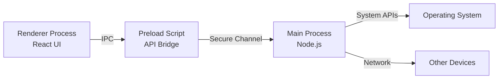
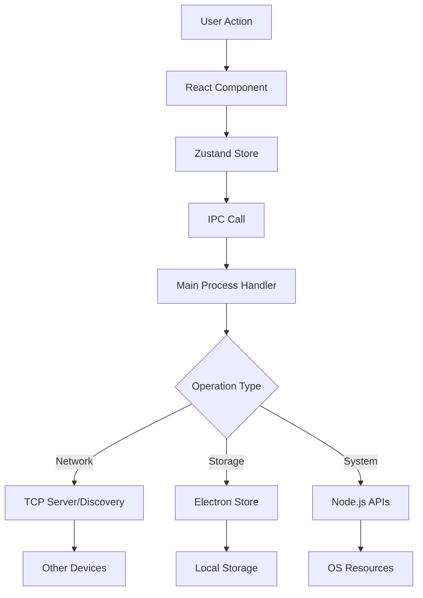

# Architecture Overview

HyperConnect is built on Electron, which combines Chromium and Node.js to create cross-platform desktop applications. This architecture allows us to use web technologies while accessing native system capabilities.

## Electron Architecture

Electron applications consist of two main processes:

### Main Process

The **Main Process** runs in Node.js and has full access to system APIs. It's responsible for:

- Creating and managing application windows
- Handling system-level operations (file system, networking)
- Managing the application lifecycle
- Coordinating inter-process communication (IPC)

**Key Files:**

- `src/main/index.ts` - Application entry point
- `src/main/ipc.ts` - IPC handlers
- `src/main/tcpServer.ts` - TCP server for device communication
- `src/main/discovery.ts` - Network discovery service

### Renderer Process

The **Renderer Process** runs in Chromium and handles the user interface. Each window has its own renderer process. It's responsible for:

- Rendering the React-based UI
- Handling user interactions
- Managing application state
- Communicating with the main process via IPC

**Key Directories:**

- `src/renderer/` - All React components and UI code
- `src/renderer/pages/` - Application views/pages
- `src/renderer/components/` - Reusable UI components
- `src/renderer/store/` - Zustand state management

### Preload Scripts

The **Preload Script** acts as a secure bridge between the main and renderer processes:

- Exposes specific APIs to the renderer
- Maintains security by controlling what the renderer can access
- Uses `contextBridge` to safely expose functions

**Key File:**

- `src/preload/index.ts` - API exposure and type definitions

## Communication Flow



### IPC (Inter-Process Communication)

HyperConnect uses Electron's IPC mechanism for communication:

1. **Renderer → Main**: Uses `window.api.methodName()` (exposed via preload)
2. **Main → Renderer**: Uses `webContents.send()` for events

Example flow:

```typescript
// Renderer: Request device list
const devices = await window.api.getDevices()

// Main: Handle request
ipcMain.handle('get-devices', () => {
  return deviceManager.getDevices()
})
```

## Technology Stack

### Core Technologies

- **Electron 39** - Desktop application framework
- **React 19** - UI library with latest features
- **TypeScript 5** - Type-safe development
- **Vite 7** - Fast build tool via electron-vite

### UI & Styling

- **Tailwind CSS 4** - Utility-first CSS framework
- **Radix UI** - Accessible component primitives
- **Lucide React** - Icon library
- **Sonner** - Toast notifications

### State & Routing

- **Zustand** - Lightweight state management
- **React Router 7** - Client-side routing

### Networking & Security

- **Bonjour Service** - mDNS/Bonjour for device discovery
- **Node.js Crypto** - Encryption for messages and files
- **TCP Sockets** - Direct device-to-device communication

### Development Tools

- **electron-vite** - Vite-based build tool for Electron
- **ESLint** - Code linting
- **Prettier** - Code formatting
- **electron-builder** - Application packaging

## Security Model

HyperConnect implements multiple security layers:

### Context Isolation

- Renderer processes run with `contextIsolation: true`
- Prevents direct access to Node.js APIs from renderer
- All communication goes through the secure preload bridge

### Node Integration

- `nodeIntegration: false` in renderer processes
- Prevents arbitrary Node.js code execution in the UI

### Content Security

- `webSecurity: true` enforces same-origin policy
- Protects against XSS and other web vulnerabilities

### Encryption

- All messages and files are encrypted using AES-256-GCM
- Unique encryption keys per device pair
- Secure key exchange during device pairing

## Data Flow



## Build Process

HyperConnect uses electron-vite for building:

1. **TypeScript Compilation**: TSC compiles TypeScript to JavaScript
2. **Main Process Build**: Vite bundles main process code
3. **Renderer Build**: Vite bundles React app with optimizations
4. **Preload Build**: Vite bundles preload scripts
5. **Packaging**: electron-builder creates platform-specific installers

## Next Steps

- [Project Structure](/docs/architecture/project-structure) - Detailed directory layout
- [Device Discovery](/docs/features/device-discovery) - How network discovery works
- [IPC Handlers](/docs/api/ipc-handlers) - Available IPC methods
