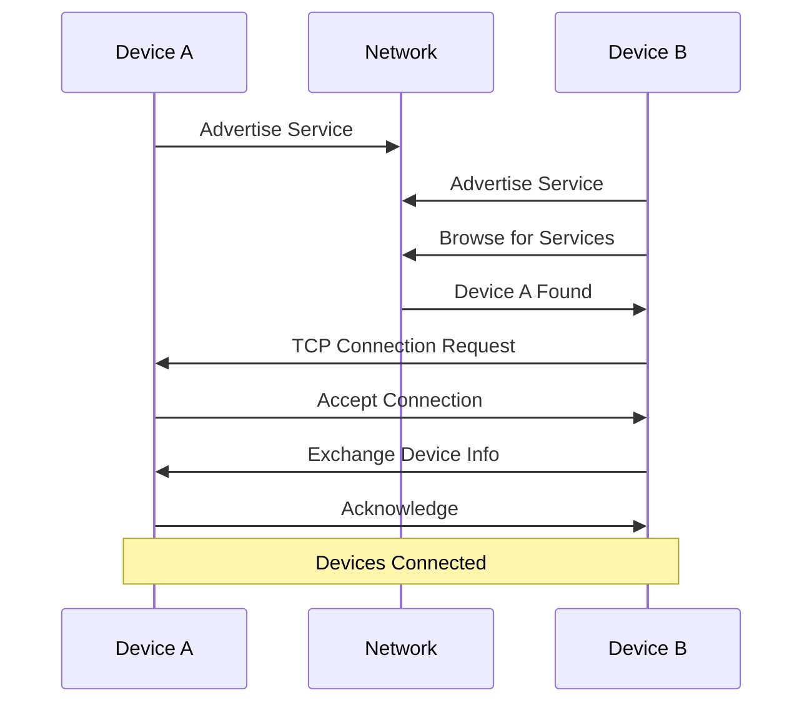

# Device Discovery

HyperConnect uses Bonjour/mDNS (multicast DNS) for automatic device discovery on the local network. This allows devices to find each other without manual configuration.

## Overview

The discovery system enables:

- **Automatic Detection**: Devices announce themselves on the network
- **Zero Configuration**: No manual IP address or port configuration needed
- **Real-time Updates**: Instant notification when devices join or leave
- **Cross-Platform**: Works on macOS, Windows, and Linux

## How It Works

### Service Advertisement

When HyperConnect starts, it advertises itself on the network:

```typescript
// Main process: discovery.ts
bonjour.publish({
  name: deviceName,
  type: 'hyperconnect',
  port: tcpPort,
  txt: {
    id: deviceId,
    version: appVersion
  }
})
```

**Advertised Information:**

- **Name**: User-friendly device name
- **Type**: Service type (`hyperconnect`)
- **Port**: TCP port for connections
- **TXT Records**: Additional metadata (device ID, version)

### Service Discovery

HyperConnect continuously browses for other devices:

```typescript
// Browse for HyperConnect services
const browser = bonjour.find({ type: 'hyperconnect' })

browser.on('up', (service) => {
  // New device found
  handleDeviceDiscovered(service)
})

browser.on('down', (service) => {
  // Device went offline
  handleDeviceLeft(service)
})
```

### Connection Flow



## Implementation Details

### Discovery Service

The discovery service is implemented in `src/main/discovery.ts`:

**Key Functions:**

- `startDiscovery()` - Initialize Bonjour service and start advertising
- `stopDiscovery()` - Stop advertising and browsing
- `handleServiceUp()` - Handle newly discovered devices
- `handleServiceDown()` - Handle devices going offline

### Device Information

Each discovered device provides:

```typescript
interface DiscoveredDevice {
  id: string // Unique device identifier
  name: string // User-friendly name
  host: string // IP address
  port: number // TCP port
  addresses: string[] // All IP addresses
  txt: {
    version: string // App version
  }
}
```

### IPv4 Filtering

HyperConnect filters for IPv4 addresses to ensure compatibility:

```typescript
// Get IPv4 address from service
const ipv4Address = service.addresses?.find(
  (addr) => addr.includes('.') // IPv4 format
)
```

## Network Requirements

### Firewall Configuration

For device discovery to work, ensure:

1. **mDNS/Bonjour** is allowed through the firewall
2. **TCP port** (default: 3000) is open for incoming connections
3. **Local network access** is permitted (macOS requires explicit permission)

### macOS Permissions

On macOS, HyperConnect requests Local Network permission:

```yaml
# electron-builder.yml
mac:
  extendInfo:
    NSLocalNetworkUsageDescription: >-
      HyperConnect needs access to your local network to discover
      and connect to other devices.
    NSBonjourServices:
      - _hyperconnect._tcp
```

Users will see a system prompt on first launch requesting permission.

### Network Topology

Device discovery works on:

- ✅ Same WiFi network
- ✅ Same wired LAN
- ✅ Bridged networks
- ❌ Different subnets (without mDNS relay)
- ❌ VPN connections (typically)

## Device States

Discovered devices can be in several states:

| State          | Description                                 |
| -------------- | ------------------------------------------- |
| **Discovered** | Device found on network but not connected   |
| **Connecting** | Connection attempt in progress              |
| **Connected**  | Active TCP connection established           |
| **Offline**    | Device no longer advertising (left network) |

State transitions are managed in `src/main/tcpServer.ts` and communicated to the renderer via IPC events.

## Troubleshooting

### Devices Not Appearing

1. **Check network connection**: Ensure both devices are on the same network
2. **Firewall settings**: Verify firewall allows mDNS and TCP connections
3. **macOS permissions**: Grant Local Network permission when prompted
4. **Restart discovery**: Try restarting the application

### Intermittent Connectivity

If devices show as "offline/online" repeatedly:

- Check for IPv6 conflicts (HyperConnect filters to IPv4)
- Verify network stability
- Check for mDNS packet loss

### Port Conflicts

If the default port (3000) is in use:

- HyperConnect will automatically try alternative ports
- Check the application logs for the actual port being used

## API Reference

### IPC Methods

**`startDiscovery()`**

- Starts the discovery service
- Returns: `Promise<void>`

**`stopDiscovery()`**

- Stops the discovery service
- Returns: `Promise<void>`

**`getDiscoveredDevices()`**

- Gets list of currently discovered devices
- Returns: `Promise<DiscoveredDevice[]>`

### Events

**`device-discovered`**

- Emitted when a new device is found
- Payload: `DiscoveredDevice`

**`device-left`**

- Emitted when a device goes offline
- Payload: `{ id: string }`

## Next Steps

- [Messaging](/docs/features/messaging) - Learn about secure messaging
- [File Transfer](/docs/features/file-transfer) - Understand file sharing
- [Main Process API](/docs/api/main-process) - Explore discovery API details
