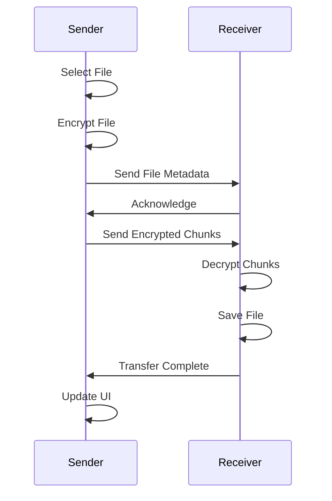

# File Transfer

HyperConnect enables secure file transfer between connected devices with encryption, progress tracking, and resume capability.

## Features

- **🔐 Encrypted Transfer**: Files encrypted with AES-256-GCM
- **📊 Progress Tracking**: Real-time upload/download progress
- **⏸️ Pause/Resume**: Pause and resume large transfers (future)
- **📁 Multiple Files**: Send multiple files simultaneously
- **🖼️ File Preview**: Preview images and documents
- **💾 Auto-Save**: Automatic save location or choose destination

## Sending Files

### Select and Send

Send files to a connected device:

```typescript
// Renderer process
const files = await window.api.selectFiles()
for (const file of files) {
  await window.api.sendFile(deviceId, file.path)
}
```

### File Selection

Users can select files via:

- **File picker dialog**: Standard OS file picker
- **Drag and drop**: Drag files into chat window
- **Context menu**: Right-click to send file

### Supported File Types

HyperConnect supports all file types:

- Documents (PDF, DOCX, TXT, etc.)
- Images (PNG, JPG, GIF, etc.)
- Videos (MP4, MOV, etc.)
- Archives (ZIP, TAR, etc.)
- Any other file type

## File Transfer Process

### Transfer Flow



### Implementation Details

**File Metadata:**

```typescript
interface FileMetadata {
  id: string // Unique transfer ID
  name: string // Original filename
  size: number // File size in bytes
  type: string // MIME type
  checksum: string // SHA-256 checksum
}
```

**Chunk Transfer:**

- Files split into 64KB chunks
- Each chunk encrypted separately
- Progress updated per chunk
- Checksum verified on completion

## Encryption

### File Encryption

Files are encrypted before transmission:

```typescript
// Main process: fileTransfer.ts
const encryptedChunk = encryptData(chunk, sharedKey)
```

**Encryption Process:**

1. Read file in chunks (64KB)
2. Encrypt each chunk with AES-256-GCM
3. Send encrypted chunks over TCP
4. Decrypt chunks on receiver
5. Write to destination file

### Security Features

- **In-transit encryption**: All data encrypted during transfer
- **At-rest encryption**: Optional encryption of received files
- **Integrity verification**: SHA-256 checksum validation
- **Secure deletion**: Original chunks securely deleted after transfer

## Progress Tracking

### Real-time Updates

Track transfer progress in real-time:

```typescript
// Event: file-progress
window.api.onFileProgress((event) => {
  const { fileId, progress, speed } = event
  updateProgressBar(fileId, progress)
  displaySpeed(speed)
})
```

**Progress Information:**

- **Percentage**: 0-100% completion
- **Bytes transferred**: Current/total bytes
- **Transfer speed**: MB/s or KB/s
- **Time remaining**: Estimated completion time

### Progress Display

Progress shown in:

- **Chat bubble**: Inline progress bar
- **Notification**: System notification with progress
- **Status bar**: Overall transfer status

## File Storage

### Received Files

Files are saved to:

- **Default location**: `~/Downloads/HyperConnect/`
- **Custom location**: User-selected directory
- **Per-device folders**: Optional organization by sender

### Storage Management

```typescript
// Configure save location
await window.api.setDownloadPath(path)

// Get current save location
const path = await window.api.getDownloadPath()
```

**Storage Options:**

- Automatic save to default location
- Prompt for location per file
- Remember location per device
- Organize by date/sender

## File Preview

### Supported Previews

Preview files before downloading:

- **Images**: Thumbnail preview in chat
- **Documents**: First page preview (future)
- **Videos**: Thumbnail from first frame (future)

### Preview Generation

```typescript
// Generate thumbnail for image
const thumbnail = await generateThumbnail(filePath)
```

Thumbnails are:

- Generated on sender side
- Sent with file metadata
- Displayed in chat bubble
- Cached for performance

## Error Handling

### Transfer Failures

Handle various failure scenarios:

**Network Interruption:**

- Automatic retry (up to 3 attempts)
- Resume from last successful chunk
- User notification of failure

**Insufficient Space:**

- Check available space before transfer
- Notify user if insufficient
- Offer to choose different location

**Encryption Errors:**

- Log error details
- Notify user
- Abort transfer safely

### Validation

Files are validated:

- **Checksum verification**: SHA-256 hash comparison
- **Size verification**: Expected vs actual size
- **Type verification**: MIME type validation

## Performance Optimization

### Chunking Strategy

Optimize for different file sizes:

- **Small files** (<1MB): Single chunk
- **Medium files** (1-100MB): 64KB chunks
- **Large files** (>100MB): 256KB chunks

### Concurrent Transfers

Support multiple simultaneous transfers:

- Up to 5 concurrent file transfers
- Queue additional transfers
- Priority based on file size (smaller first)

### Compression

Optional compression for text files:

- Compress before encryption
- Decompress after decryption
- Configurable in settings

## API Reference

### IPC Methods

**`sendFile(deviceId, filePath, replyTo?)`**

- Send a file to a device
- Parameters:
  - `deviceId`: Target device ID
  - `filePath`: Absolute path to file
  - `replyTo`: Optional message ID
- Returns: `Promise<string>` (transfer ID)

**`selectFiles()`**

- Open file picker dialog
- Returns: `Promise<{ path: string, name: string }[]>`

**`cancelFileTransfer(transferId)`**

- Cancel an ongoing transfer
- Parameters:
  - `transferId`: Transfer ID
- Returns: `Promise<void>`

**`setDownloadPath(path)`**

- Set default download location
- Parameters:
  - `path`: Directory path
- Returns: `Promise<void>`

### Events

**`file-received`**

- Emitted when file transfer starts
- Payload: `{ id: string, name: string, size: number }`

**`file-progress`**

- Emitted during transfer
- Payload: `{ id: string, progress: number, speed: number }`

**`file-complete`**

- Emitted when transfer completes
- Payload: `{ id: string, path: string }`

**`file-error`**

- Emitted on transfer error
- Payload: `{ id: string, error: string }`

## Best Practices

1. **Validate files**: Check size and type before sending
2. **Show progress**: Always display transfer progress
3. **Handle errors**: Gracefully handle failures
4. **Verify integrity**: Always verify checksums
5. **Manage storage**: Monitor available disk space

## Troubleshooting

### Slow Transfers

If transfers are slow:

- Check network connection quality
- Reduce concurrent transfers
- Disable compression for binary files

### Failed Transfers

If transfers fail:

- Verify network connectivity
- Check available disk space
- Ensure file permissions are correct
- Try smaller files first

### Corrupted Files

If files are corrupted:

- Checksum mismatch indicates corruption
- Request re-transfer
- Check for network issues

## Next Steps

- [Messaging](/docs/features/messaging) - Learn about messaging
- [IPC Handlers](/docs/api/ipc-handlers) - Explore file transfer APIs
- [Main Process](/docs/api/main-process) - Understand file transfer implementation
