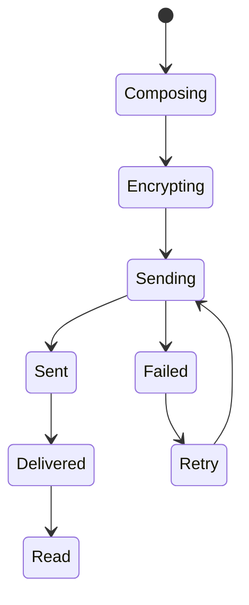

# Messaging

HyperConnect provides secure, end-to-end encrypted messaging between connected devices. Messages are encrypted using AES-256-GCM before transmission.

## Features

- **🔐 End-to-End Encryption**: All messages encrypted with AES-256-GCM
- **↩️ Reply to Messages**: Quote and reply to specific messages
- **➡️ Forward Messages**: Forward messages to other devices
- **📋 Copy to Clipboard**: Easily copy message content
- **🗑️ Delete Messages**: Remove messages from your history
- **📅 Date Separators**: Messages grouped by date
- **🔔 Desktop Notifications**: Get notified of new messages

## Sending Messages

### Basic Message

Send a text message to a connected device:

```typescript
// Renderer process
await window.api.sendMessage(deviceId, messageText)
```

The message is:

1. Encrypted using the device's shared key
2. Sent over the TCP connection
3. Decrypted by the receiving device
4. Displayed in the chat interface

### Reply to Message

Reply to a specific message:

```typescript
// Renderer process
await window.api.sendMessage(deviceId, messageText, replyToMessageId)
```

The reply includes a reference to the original message, which is displayed as a quote in the chat bubble.

### Forward Message

Forward a message to another device:

```typescript
// Select device and forward
const targetDeviceId = await selectDevice()
await window.api.sendMessage(targetDeviceId, originalMessage.text)
```

## Message Structure

Each message contains:

```typescript
interface NetworkMessage {
  id: string // Unique message ID
  text: string // Message content
  timestamp: number // Unix timestamp
  sender: string // Sender device ID
  receiver: string // Receiver device ID
  type: 'TEXT' | 'FILE' // Message type
  replyTo?: string // ID of message being replied to
  encrypted: boolean // Encryption status
}
```

## Encryption

### Message Encryption

Messages are encrypted before transmission:

```typescript
// Main process: protocol.ts
const encryptedMessage = encryptMessage(JSON.stringify(message), sharedKey)
```

**Encryption Details:**

- **Algorithm**: AES-256-GCM
- **Key Size**: 256 bits
- **Authentication**: Built-in with GCM mode
- **IV**: Randomly generated for each message

### Key Management

Each device pair has a unique shared key:

```typescript
// Keys are generated during connection
const sharedKey = generateSharedKey(deviceId)

// Stored securely in electron-store
keyStore.set(`key-${deviceId}`, sharedKey)
```

Keys are:

- Generated per device pair
- Stored locally using electron-store
- Never transmitted over the network
- Rotated on reconnection (optional)

## Message Display

### Chat Bubbles

Messages are displayed in chat bubbles with:

- **Sender/Receiver styling**: Different colors for sent/received
- **Timestamps**: Relative time (e.g., "2 minutes ago")
- **Status indicators**: Sent, delivered, encrypted
- **Reply preview**: Shows quoted message when replying

### Date Separators

Messages are grouped by date with separators:

- **Today**: Messages from today
- **Yesterday**: Messages from yesterday
- **Older**: Formatted date (e.g., "January 15, 2026")

### Context Menu

Right-click on messages to:

- **Reply**: Quote and reply to the message
- **Forward**: Send to another device
- **Copy**: Copy message text to clipboard
- **Delete**: Remove from message history

## Desktop Notifications

Receive notifications for new messages:

```typescript
// Main process: notifications.ts
new Notification({
  title: `New message from ${senderName}`,
  body: messagePreview,
  icon: appIcon
})
```

Notifications include:

- Sender name
- Message preview (first 100 characters)
- Click to open chat

### Notification Settings

Configure notifications in Settings:

- Enable/disable notifications
- Sound alerts
- Notification preview

## Message Storage

Messages are stored locally using electron-store:

```typescript
// Message history per device
messageStore.set(`messages-${deviceId}`, messages)
```

**Storage Details:**

- Messages stored per device
- Encrypted at rest (optional)
- Configurable retention period
- Export/import capability

## Message States

Messages go through several states:



| State          | Description                  |
| -------------- | ---------------------------- |
| **Composing**  | User typing message          |
| **Encrypting** | Message being encrypted      |
| **Sending**    | Transmission in progress     |
| **Sent**       | Successfully sent            |
| **Delivered**  | Received by other device     |
| **Read**       | Opened by recipient (future) |
| **Failed**     | Transmission failed          |

## Error Handling

### Encryption Failures

If encryption fails:

- Error logged to console
- User notified via toast
- Message not sent

### Network Failures

If sending fails:

- Automatic retry (up to 3 attempts)
- User notified of failure
- Message saved to retry queue

### Decryption Failures

If decryption fails:

- Error logged
- Message displayed as "[Encrypted message - unable to decrypt]"
- User can request key resync

## API Reference

### IPC Methods

**`sendMessage(deviceId, text, replyTo?)`**

- Send a text message
- Parameters:
  - `deviceId`: Target device ID
  - `text`: Message content
  - `replyTo`: Optional message ID to reply to
- Returns: `Promise<void>`

**`getMessages(deviceId)`**

- Get message history with a device
- Parameters:
  - `deviceId`: Device ID
- Returns: `Promise<NetworkMessage[]>`

**`deleteMessage(deviceId, messageId)`**

- Delete a message
- Parameters:
  - `deviceId`: Device ID
  - `messageId`: Message ID to delete
- Returns: `Promise<void>`

### Events

**`message-received`**

- Emitted when a new message arrives
- Payload: `NetworkMessage`

**`message-sent`**

- Emitted when a message is successfully sent
- Payload: `{ id: string, deviceId: string }`

**`message-failed`**

- Emitted when message sending fails
- Payload: `{ id: string, error: string }`

## Best Practices

1. **Keep messages concise**: Better user experience
2. **Use encryption**: Always enabled by default
3. **Handle errors gracefully**: Inform users of issues
4. **Respect privacy**: Don't log message content
5. **Implement retry logic**: Handle network issues

## Next Steps

- [File Transfer](/docs/features/file-transfer) - Learn about file sharing
- [IPC Handlers](/docs/api/ipc-handlers) - Explore messaging APIs
- [Security](/docs/architecture/overview#security-model) - Understand encryption
